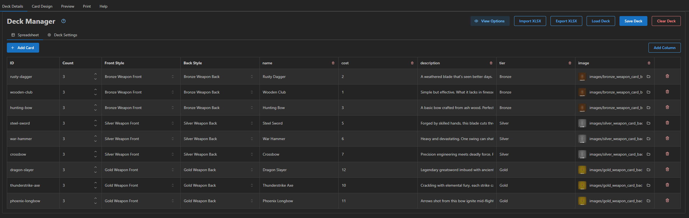
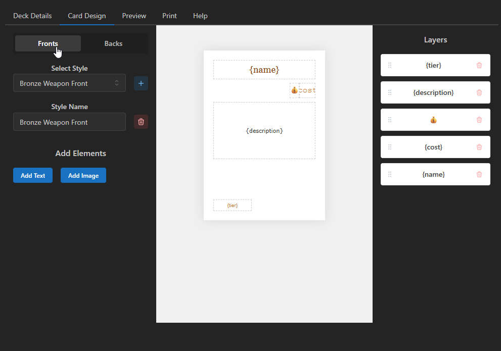
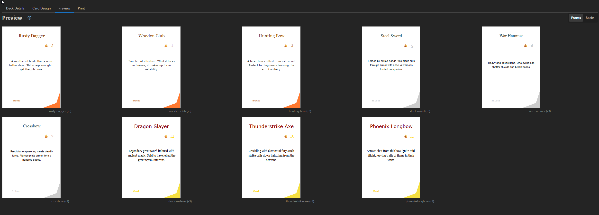

# Card Wizard 🧙‍♂️

> [!WARNING]
> **Alpha Status**: This project is currently in **ALPHA**. Features may change, and bugs are expected. Please report any issues you encounter!

Note: v0.2.0 is a rework of the application. The save format has changed and is not compatible with v0.1.3.

**Card Wizard** is a powerful desktop application designed for game designers and hobbyists to create, manage, and print custom playing cards and game components. It bridges the gap between spreadsheet data and print-ready PDFs, offering a visual design interface and robust export options.

Card Wizard is organized by "games" which are collections of decks. Each deck has its own card styles and card layouts.

### Project format

`.cwiz` files are ZIP archives containing `game.json` and project assets. The
current `game.json` contract is the embedded versioned JSON Schema at
[`internal/game/game-v1.schema.json`](internal/game/game-v1.schema.json).
Card Wizard validates the document after migrating older saves and before
writing either `.cwiz` or legacy JSON files; saves made by a newer schema
version are rejected with an actionable compatibility error.

## ✨ Features

- **Spreadsheet Integration**: Import and export card data directly from Excel (`.xlsx`) files or edit data within the app using the built-in spreadsheet view.
- **Visual Style Editor**: Design your card layouts using a drag-and-drop interface. Create unique styles for different card types (e.g., "Unit", "Spell", "Event").
- **Alignment Tools**: Quickly align elements to left, center, right, top, middle, or bottom of the card.
- **Undo/Redo**: Full undo/redo support in the Style Editor for all element modifications.
- **Layer Management**: Organize card elements into layers for easy management and reordering.
- **Shape Editor**: Create and edit basic shapes for card elements.
- **Dynamic Rendering**: Map spreadsheet columns to text and image elements on your cards.
- **Real-time Preview**: See exactly how your deck will look before printing.
- **Export Options**:
  - **Print-Ready PDF**: Generate high-quality PDFs with configurable page sizes (A4, Letter), automatic duplex layout, cut lines and safe margins.
  - **Image Export**: Export all cards as individual PNG files (front and back).
  - **Multi-Deck Excel**: Export entire games to Excel with each deck as a separate sheet.
- **Asset Gallery**: Manage project-specific images with bulk upload, replace, and delete capabilities.
- **In App Help**: Access help documentation directly from the application.

### Frontend loading

Project loading keeps the core workspace UI in the initial bundle. Card Design,
Preview, Export, and Print Preview are loaded on demand when their tab is opened;
each tab shows a loading state and offers a retry if its chunk cannot be fetched.

Measured with `cd frontend && npm run build` (Vite 7 production build):

- Initial JavaScript entry: 473.74 kB (146.75 kB gzip)
- Card Design: 180.24 kB (55.63 kB gzip), loaded on demand
- Preview: 4.00 kB (1.67 kB gzip), loaded on demand
- Export: 2.10 kB (0.85 kB gzip), loaded on demand
- Print Preview: 4.92 kB (2.13 kB gzip), loaded on demand
- Image rendering (`html2canvas-pro`): 251.47 kB (64.29 kB gzip), loaded only when an image or print preview render is requested


## 📸 Screenshots

### Deck Details

This shows how you use a spreadsheet like interface to layout all of your cards



### Card Design

This shows how you can layout the card design in a drag/drop interface with layers



### Card Preview

This shows how you can preview your cards via front or back.



## 🛠️ Tech Stack

Card Wizard is built using a modern hybrid stack, combining the performance of Go with the flexibility of web technologies:

- **Backend**: [Go](https://go.dev/) (Golang)
  - Framework: [Wails v2](https://wails.io/)
  - PDF Generation: [`go-pdf/fpdf`](https://github.com/go-pdf/fpdf)
  - Excel Processing: `excelize`
- **Frontend**:
  - [React 18](https://react.dev/)
  - [TypeScript](https://www.typescriptlang.org/)
  - [Vite 7](https://vitejs.dev/)
  - [Mantine UI v8](https://mantine.dev/)
  - [React-Rnd](https://github.com/bokuweb/react-rnd) for canvas interactions

## 👨‍💻 Developer Guide

We welcome contributions! If you want to add features or fix bugs, follow these steps to get started.

### Prerequisites

- **Go**: Version 1.21 or later.
- **Node.js**: Version 18 or later (npm included).
- **Wails CLI**: Install via `go install github.com/wailsapp/wails/v2/cmd/wails@latest`

### Setup & Running

1.  **Clone the repository**:
    ```bash
    git clone https://github.com/yourusername/card-wizard.git
    cd card-wizard
    ```

2.  **Install dependencies**:
    ```bash
    # The Wails dev command handles frontend dependency installation automatically,
    # but you can run it manually if needed:
    cd frontend && npm install && cd ..
    ```

3.  **Run in Development Mode**:
    ```bash
    wails dev
    ```
    This command will:
    - Compile the Go backend.
    - Start the Vite dev server for the frontend.
    - Launch the application window.
    - Enable hot-reloading for both Go and React code.

### Testing

Card Wizard has comprehensive test coverage for both backend and frontend code.

#### Running Tests

**Backend (Go) Tests:**
```bash
go test ./...
```

**Frontend (React) Tests:**
```bash
cd frontend
npm test
```

**Run All Tests:**
```bash
# Backend
go test ./...

# Frontend
cd frontend && npm test && cd ..
```

#### Pre-commit Hooks

We use [pre-commit](https://pre-commit.com/) to run automated checks before each commit. This ensures code quality and prevents broken commits.

**Installation:**

1. Install pre-commit (one-time setup):
   ```bash
   # Using uv (recommended)
   uv tool install pre-commit

   # Or using Homebrew (macOS/Linux)
   brew install pre-commit
   ```

2. Install the git hooks:
   ```bash
   pre-commit install
   ```

3. Install golang requirements (non-exhaustive):
   ```bash
   go install golang.org/x/tools/cmd/goimports@latest
   ```

**What it does:**

Once installed, every `git commit` will automatically run:
- ✅ **Go formatting** (`go fmt`)
- ✅ **Go linting** (`go vet`)
- ✅ **Go imports** (organize imports)
- ✅ **Go tests** (`go test ./...`)
- ✅ **Go build** (ensure code compiles)
- ✅ **Go mod tidy** (clean up dependencies)
- ✅ **Frontend tests** (`npm test`)
- ✅ **Frontend type checking** (`tsc --noEmit`)
- ✅ **File checks** (trailing whitespace, YAML/JSON validation, etc.)

**Manual run:**

To run all hooks manually without committing:
```bash
pre-commit run --all-files
```

**Bypass (emergency only):**

If you need to skip hooks in an emergency:
```bash
git commit --no-verify
```

> [!TIP]
> The `.pre-commit-config.yaml` file defines all hooks. You can customize which checks run by editing this file.

For more details on our testing strategy, see [TESTING.md](TESTING.md).

### Building for Production

To create a standalone executable:

```bash
wails build
```

The output binary will be located in the `build/bin` directory.

## 🤝 Contributing

1.  Fork the repository.
2.  Create a new feature branch (`git checkout -b feature/amazing-feature`).
3.  Commit your changes.
4.  Push to the branch.
5.  Open a Pull Request.

## 📄 License

[MIT License](LICENSE)
